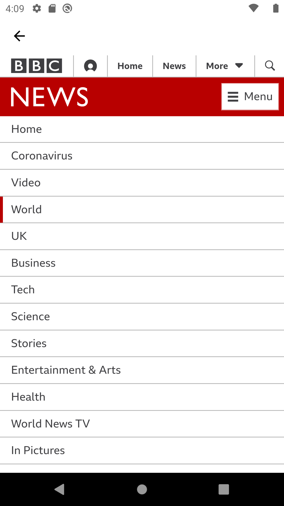

# News_Application_Flutter

News Application to know News from differents Fields and search about news.

# Technologies

- Flutter to make Cross-platform application for all users ( ios - android )
- News Api

# Properties of Application

- Simple $ Easy UI
- Light & Dark Mode
- News in many fields
- search for News

# Screenshots

     

    

